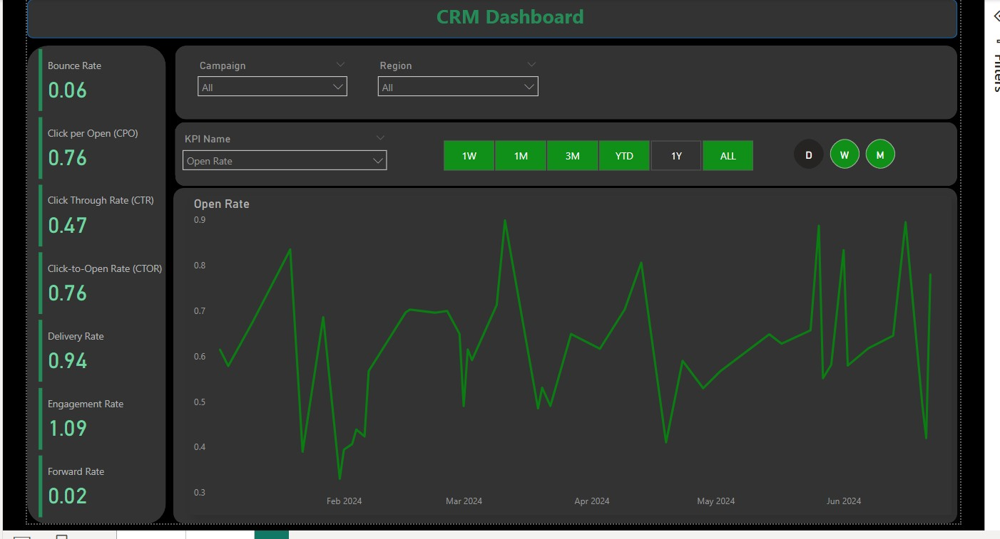

# CRM Dashboard

In this CRM dashboard I am presenting different marketing kpis like <b>Delivery Rate, Bounce Rate	Click Through Rate (CTR),Click-to-Open Rate (CTOR), Unsubscribe Rate </b> and etc. 

We can see the data for last 1 week , 1 month , 3 month, Year to date and All data, we can also aggregate the data based on day , week and month.

